# What is a Machine?

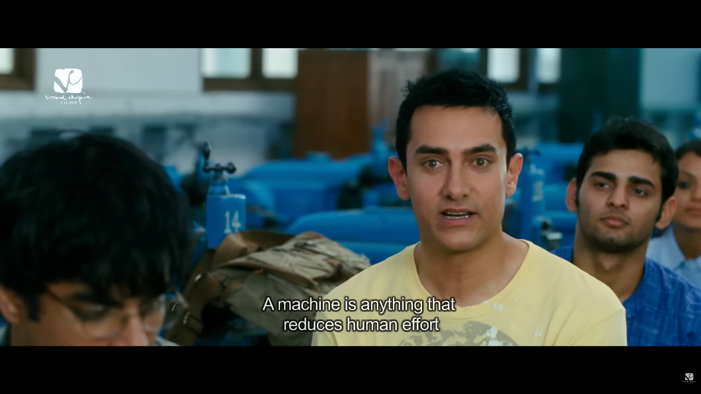

__*"A machine is anything that reduces human effort" - Rancho (3 Idiots, 2009)*__

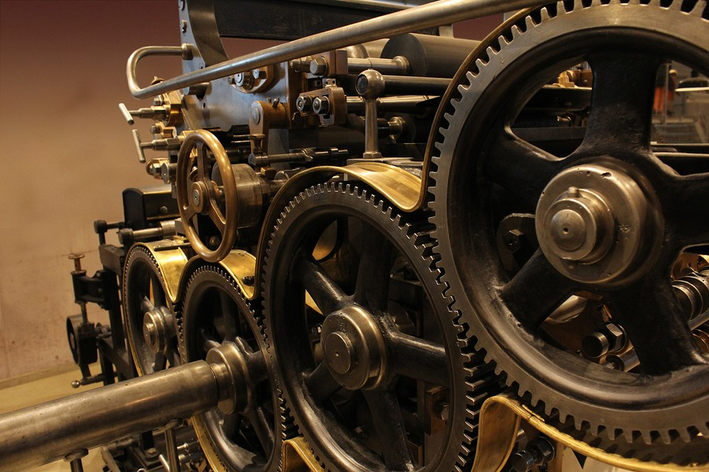

__*"A machine is a device, having a unique purpose, that augments or replaces human or animal effort for the accomplishment of physical tasks." - Britannica*__

# What is a Computer?

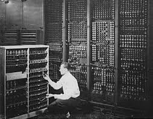

__*"A computer is an electronic device that can receive, store, process, and present data under the control."*__

## In laymans term, it is known as IPO - Input, Process, Output

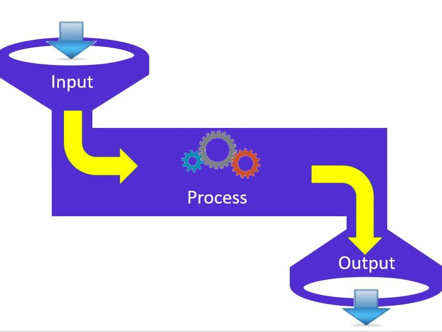

### Input - raw data, concepts, and ideas, materials

### Process - thinking, ------

### Output - product and end result

## As time goes by, technology is advancing, until the theory of "Can machines think?", where Artificial Intelligence was born.

# What is AI?
## Before that we'll try to define what is Artificial and Intelligence.

# What is Artificial

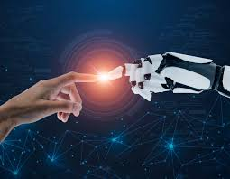

__*"Something that is made, produced, or done by humans especially to seem like something natural*__

# What is Intelligence?

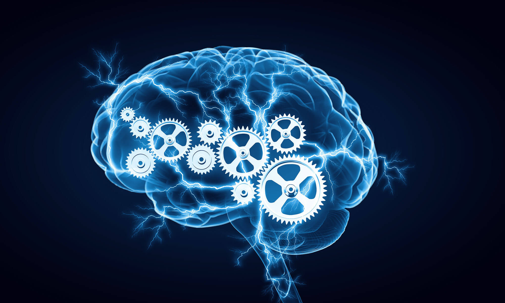

__*"Refers to the human"*__

__****__
__**Intelligence refers to the human ability to perform cognnitive tasks (mental ability) - think, understand, learn, remember**__

# What if we apply cognitive abilities to machines and computers?

# Alan Turing
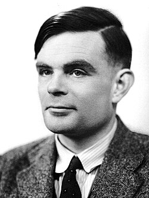

Alan Turing, known as the father of modern computing for his contributions during the second world war, decording the encryption of enigma machines used by the German armed forces to send messages securely

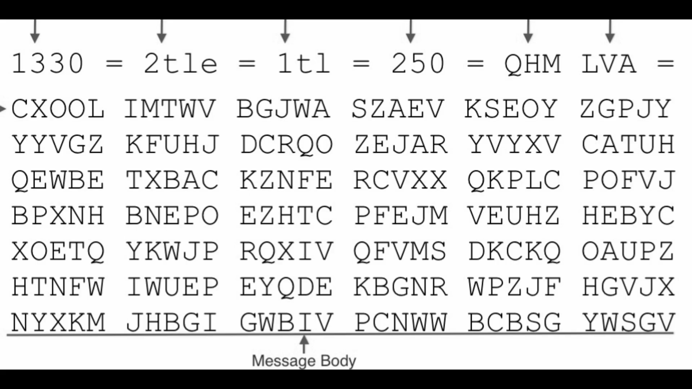

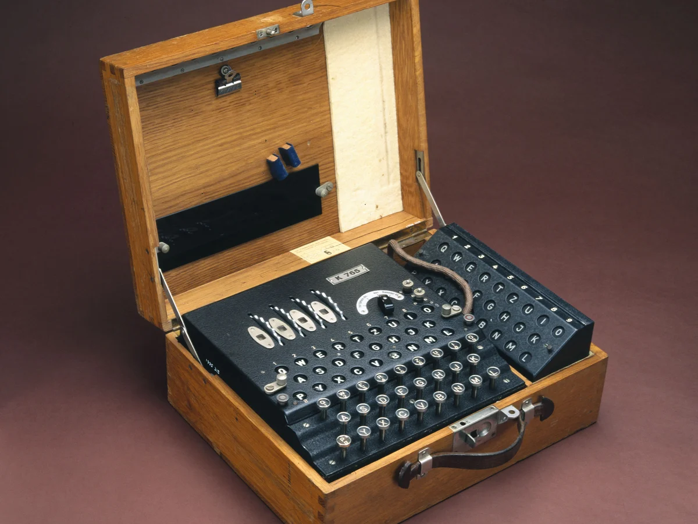

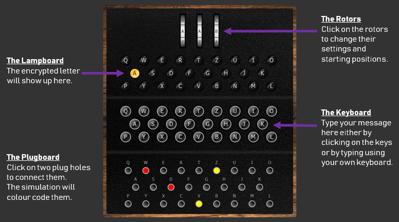

# Pushing the limits with the "Turing Test"

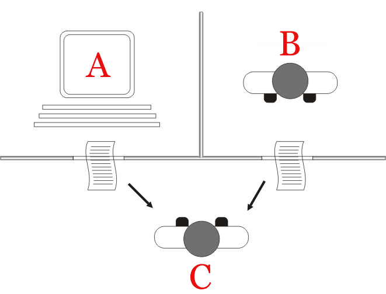

## Alan Turing had this question in mind "Can machines think?"
## Turing Test was a tool for determining machines's capabilities. Can machines actually think or exhibit intelligent behavior, or can they do only what humans have programmed them to do? And can machines mimic human-level intelligence through natural language such that their communications could be indistinguishable from humans?

### Turing test participants

A Turing test has three participants:
- A human judge (also called the interrogator): Asks questions for a machine and a human to answer. The judge evaluates the responses from the machine and the human to identify the responder. 
- A machine interlocutor (such as a generative AI system): Answers the judge’s questions in natural language that simulates human conversation and behavior.
- A human interlocutor: Answers the judge’s questions alongside the machine and provides a baseline for comparison against the machine. 

### Turing questions 

Asking the human and machine interlocutors questions allows these test participants to form written responses that the judge can evaluate and compare. The purpose is to find out if the machine’s answers can convince the judge that the human interlocutor produced them.

There is no official list of questions to pose to the human and the machine during a Turing test. Asking the following types of questions, though, can help you tell the machine’s answers from the human’s because they require the interlocutor to generate thoughtful, context-rich, socially appropriate responses.
- Open-ended questions like, “What’s a skill or talent you’d like to develop and why?” 
- Opinion questions like, “What is your perspective on technology and its impact on mental health?”
- Emotional questions like, “What’s something from the past that you long for?”
- Personal questions like, “What was it like to fall in love for the first time?”
- Hypothetical scenarios like, “Imagine that you are a museum curator in the future. What artifacts of today would you display in the museum and why?”
- Self-assessment questions like, “How do you think you performed on this test? How human-like are your answers to my questions?”

### Limitations of the Turing test
- To this day, the Turing test is a valuable tool for learning more about AI. It does have some limitations, which are important to consider as we seek to understand and improve AI.
- There’s no way for the test to determine whether a machine is truly intelligent in the sense that it actually understands the conversation in which it participates. The test only helps humans observe how well a machine can produce outputs that are close enough to human conversation so as to be indistinguishable. 
- The evaluation of the human judge will be subjective, based on their own understanding of how a human communicates. In some cases, the confederate effect may occur, which refers to instances when a human interlocutor is falsely identified as a machine. 
- Human judges may be limited in their knowledge of what some test questions address. For instance, the sample question above—"What is your perspective on technology and its impact on mental health?"—may be outside the scope of the judge’s knowledge or experience, making it difficult for the judge to determine if the interlocutors provide sufficient answers. 
- The questions you select determine the kind of responses from both interlocutors and whether the responses can provide adequate insight into how human and machine communication compares. For example, if the questions focus mostly on uniquely human abilities like creativity or empathy, then the AI’s responses might expose it as non-human more readily. 

Can Machines Think?
The idea of "thinking machines" has existed for centuries in myths and fiction, but the real story begins in the mid-20th century when scientists started turning that question into actual experiments.

The Birth of AI (1940s–1950s)
In 1943, researchers McCulloch and Pitts proposed that the brain could be modeled as a computing system — introducing the concept of artificial neurons, the foundation of today's neural networks.
In 1950, British mathematician Alan Turing asked whether machines could behave intelligently enough to be mistaken for humans. His proposed test — now called the Turing Test — remains one of AI's most famous ideas.
Then in 1956, John McCarthy organized a workshop at Dartmouth College and coined the term "artificial intelligence." This event is considered the official birthday of the field.

Early Programs and AI Winters (1960s–1990s)
Early AI showed promise in narrow settings: ELIZA (1966), the first chatbot, fooled users into thinking it was a real therapist. Expert systems like MYCIN helped with medical diagnosis using "if-then" rules. Shakey the Robot could navigate rooms using sensors.
But progress couldn't keep up with the hype. A critical 1973 report argued that researchers had over-promised and under-delivered ibm, leading to funding cuts and the first "AI winter." A second winter followed in the late 1980s. AI's history is defined by this cycle: excitement → overpromising → disappointment → eventual breakthroughs.
Still, important groundwork was laid. Backpropagation (1986) gave neural networks a way to learn from mistakes, and IBM's Deep Blue defeated world chess champion Garry Kasparov in 1997 ibm — the first time a computer beat a reigning champion.

The Modern AI Breakthrough (2000s–2010s)
Three ingredients finally came together: massive data from the internet, powerful hardware (especially GPUs), and better algorithms like deep learning.
Key moments: IBM Watson won Jeopardy! (2011), Siri and Alexa brought AI to everyday life, Geoffrey Hinton's deep learning breakthrough transformed image recognition (2012), and AlphaGo defeated one of the world's best Go players in a game more complex than chess by orders of magnitude coursera (2016).

The Generative AI Era (2020–Present)
Generative AI refers to systems that create new content — text, images, audio, video, and code — by learning patterns from massive datasets. medium This is the era of ChatGPT, DALL-E, Gemini, and similar tools.
The key technology behind this is the Large Language Model (LLM) — AI trained on enormous amounts of text to learn language patterns. GPT-3 (2020), with 175 billion parameters, showed that AI could generate human-like text and perform tasks with minimal specific training. ibm ChatGPT (2022) made this accessible to everyone.

Key Concepts at a Glance

Machine Learning — AI learns from examples rather than following hard-coded rules. Three types: supervised (labeled data), unsupervised (finding hidden patterns), and reinforcement (trial-and-error with rewards).
Neural Networks / Deep Learning — Layers of artificial "neurons" inspired by the brain that can learn increasingly complex patterns.
Large Language Models — Systems like GPT that learn statistical patterns in language to produce coherent text. They don't truly "understand" — they predict.
Training Data — AI reflects whatever data it was trained on, including any biases in that data.
Prompt Engineering — Designing effective inputs to guide AI outputs — a practical skill you'll develop in this seminar.