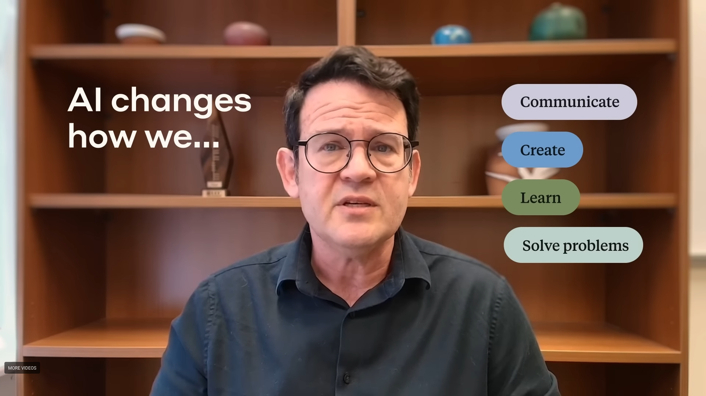
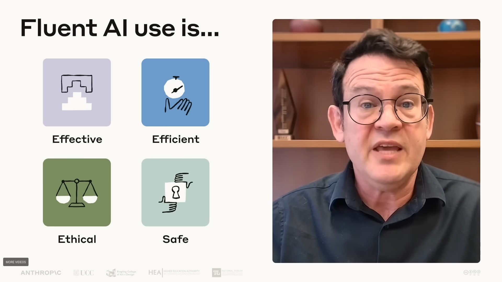
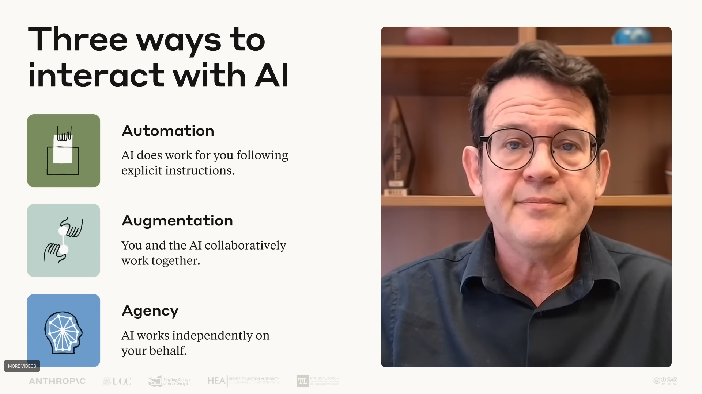

# AI Fluency

## What does it means and why it matters?







# Framework for AI Fluency: Practical Overview
**Authors:** Rick Dakan (Ringling College of Art and Design, Florida) & Joseph Feller (Cork University Business School, University College Cork, Ireland)
**Version:** 1.1 (January 13, 2025)
**License:** CC BY-NC-ND 4.0
**Source:** https://ringling.libguides.com/ai/framework

---

## Overview

The Framework for AI Fluency describes the interconnected competencies needed to use AI in creative, innovative, and problem-solving work. Rather than viewing AI merely as an efficiency engine, the framework recognizes AI's potential to act as an **authentic thinking partner** for meaningful cognitive work—while acknowledging this potential can only be realized through specific human competencies.

### Definition of AI Fluency

> **AI Fluency** is the ability to work effectively, efficiently, ethically, and safely within emerging modalities of Human-AI interaction.

---

## The Three Modalities of Human-AI Interaction

The framework identifies three distinct ways humans interact with AI systems:

### Modality 1: Automation
**AI Performs Human-Defined Task**

| Aspect | Description |
|--------|-------------|
| **Nature** | AI performs tasks independently based on direct human instructions (e.g., in response to a prompt) |
| **Best for** | Improving efficiency of repetitive, time-consuming, or data-intensive tasks |
| **Requirements** | Clear task definition and quality control measures |
| **Examples** | Emails, summaries, social media posts, basic coding |

---

### Modality 2: Augmentation
**AI and Human Perform Task Collaboratively**

| Aspect | Description |
|--------|-------------|
| **Nature** | AI and human co-define and co-execute tasks iteratively, collaborating toward an end goal |
| **Best for** | Enhancing human creativity through an AI thinking partner |
| **Requirements** | Dynamic interplay between human and AI contributions |
| **Examples** | Writing stories, essays, research papers, complex coding tasks |

---

### Modality 3: Agency
**Human Configures AI to Perform Tasks Independently**

| Aspect | Description |
|--------|-------------|
| **Nature** | Human configures AI to independently perform future tasks (including for others) on behalf of the user |
| **Best for** | Defining characteristics and future behavior of an AI system |
| **Requirements** | Sophisticated understanding of AI capabilities and limitations |
| **Examples** | Interactive game characters, tutors, chatbots |

**Important Note:** Human-AI interactions often bridge multiple modalities, and practitioners frequently move between contexts even within single projects or workflows.

---

## The Four Core Competencies ("The 4 Ds")

The framework identifies four interconnected competencies that enable practitioners to:
- Make appropriate decisions about if, when, and how to use AI tools
- Effectively communicate desired outputs and behaviors to AI systems
- Accurately assess the quality and appropriateness of AI outputs and behaviors
- Ensure ethical practice, transparency, and accountability
```
           ┌─────────────┐
           │  Delegation │
           └──────┬──────┘
                  │
    ┌─────────────┼─────────────┐
    │             │             │
    ▼             │             ▼
┌───────────┐     │     ┌─────────────┐
│Description│◄────┼────►│ Discernment │
└───────────┘     │     └─────────────┘
                  │
                  ▼
           ┌─────────────┐
           │  Diligence  │
           └─────────────┘
```

---

### 1. Delegation
**Creative vision and selection of the right AI tools and techniques to realize that vision**

Delegation is the ability to identify **when and how** to use AI tools and modalities effectively in creative and problem-solving processes. It involves understanding AI capabilities and limitations and making informed decisions about when to use AI for automation, augmentation, or agency.

#### Sub-competencies:

| Sub-category | Focus | Key Skills |
|--------------|-------|------------|
| **Goal and Task Awareness** | Understanding project requirements | Envisioning effective goals; analyzing and deconstructing tasks into AI, human, and collaborative components |
| **Platform Awareness** | Knowing AI tool capabilities | Understanding various AI platforms' strengths and limitations; evaluating tools based on project requirements, budget, and regulatory needs |
| **Task Delegation** | Optimal assignment of work | Balancing AI and human capabilities; understanding different affordances of each modality; assigning tasks optimally |

---

### 2. Description
**Effectively describing a vision and/or tasks to prompt useful AI behaviors and outputs**

Description encompasses skills needed to effectively communicate ideas, requirements, constraints, and creative visions to AI systems. It involves crafting clear, specific, and well-structured prompts using a wide range of prompting techniques.

#### Sub-competencies:

| Sub-category | Focus | Key Skills |
|--------------|-------|------------|
| **Product Description** | Defining desired output | Clearly articulating desired characteristics, features, and qualities; translating creative vision into AI-understandable terms |
| **Process Description** | Guiding iterative collaboration | Engaging in dynamic, back-and-forth communication; breaking complex tasks into smaller, manageable prompts |
| **Performance Description** | Defining future AI behaviors | Specifying how AI should behave or interact; anticipating user needs and translating them into behavioral guidelines |

---

### 3. Discernment
**Accurately assessing the usefulness of AI outputs**

Discernment involves critical evaluation of AI-generated outputs—understanding their quality, relevance, potential biases, and other characteristics. It includes the ability to iterate and refine the collaborative process with AI tools.

#### Sub-competencies:

| Sub-category | Focus | Key Skills |
|--------------|-------|------------|
| **Product Discernment** | Evaluating output quality | Critically assessing quality, relevance, and effectiveness; identifying strengths and weaknesses in AI outputs |
| **Process Discernment** | Assessing collaboration effectiveness | Evaluating the human-AI collaborative process; identifying beneficial aspects and areas for improvement |
| **Performance Discernment** | Evaluating AI behaviors | Assessing AI effectiveness in user-facing scenarios; gathering and interpreting feedback to refine AI-driven experiences |

---

### 4. Diligence
**Taking responsibility and vouching for final products created using AI**

Diligence refers to responsible AI use, including ethical considerations, transparency about AI use, and taking accountability for final products created with AI assistance.

#### Sub-competencies:

| Sub-category | Focus | Key Skills |
|--------------|-------|------------|
| **Creation Diligence** | Ethical AI use | Applying ethical principles throughout the process; identifying and mitigating biases and ethical risks |
| **Transparency Diligence** | Honest disclosure | Understanding audience and legal expectations; clearly communicating AI involvement in the process |
| **Deployment Diligence** | Verification and accountability | Thorough fact-checking and testing; managing and assuming responsibility for potential risks and impacts |

---

## Key Framework Advantages

The authors identify three key advantages of this framework:

| Advantage | Description |
|-----------|-------------|
| **Platform and Technology Agnostic** | Independent of specific tools or platforms; adaptable to emerging and rapidly evolving technologies |
| **Contextual and Flexible** | Characterizes effective action rather than prescribing rigid processes; compatible with other skills taxonomies |
| **Ethics-Centered** | Treats ethical considerations as fundamental; recognizes responsible AI use is as important as responsible AI design |

---

## Summary: The 4 Ds at a Glance

| Competency | Core Question | Focus |
|------------|---------------|-------|
| **Delegation** | "Should I use AI, and which tools?" | Strategic decision-making about AI integration |
| **Description** | "How do I communicate my vision to AI?" | Effective prompting and communication |
| **Discernment** | "Is this output good enough?" | Critical evaluation and quality assessment |
| **Diligence** | "Am I using AI responsibly?" | Ethics, transparency, and accountability |

---

## Applying the Framework: Quick Reference

### For Each Modality, Ask:

**Automation (AI does the task):**
- Delegation: Is this task suitable for full AI execution?
- Description: Have I clearly defined the expected output?
- Discernment: Does the output meet quality standards?
- Diligence: Have I verified accuracy and disclosed AI use?

**Augmentation (AI collaborates with me):**
- Delegation: How should human and AI contributions be balanced?
- Description: Am I engaging in effective back-and-forth dialogue?
- Discernment: Is this collaboration producing better results than either alone?
- Diligence: Am I maintaining creative ownership and ethical standards?

**Agency (AI acts independently):**
- Delegation: Have I properly configured the AI's boundaries and behaviors?
- Description: Have I clearly defined how the AI should interact with users?
- Discernment: Is the AI behaving as intended across different scenarios?
- Diligence: Am I taking responsibility for the AI's actions and impacts?

---

## Relevance for Educators

This framework is particularly valuable for:

| Application | How the Framework Helps |
|-------------|------------------------|
| **Curriculum Design** | Provides structure for teaching AI literacy across disciplines |
| **Assessment Design** | Offers criteria for evaluating student AI use |
| **Academic Policy** | Informs guidelines for appropriate AI use in coursework |
| **Student Employability** | Prepares students with transferable AI competencies |
| **Career Coaching** | Helps students articulate AI skills to employers |

---

## Source Information

**Document Title:** Framework for AI Fluency: Practical Overview Document
**Version:** 1.1
**Date:** January 13, 2025
**Authors:**
- Rick Dakan, Professor of Creative Writing & AI Coordinator, Ringling College of Art and Design (rdakan@c.ringling.edu)
- Joseph Feller, Professor of Information Systems and Digital Transformation, Cork University Business School, University College Cork, Ireland (jfeller@ucc.ie)

**Institutional Context:** Informed by student courses, faculty seminars, and workshops at both institutions during the 2023/2024, 2024/2025, and 2025/2026 Academic Years.

**License:** CC BY-NC-ND 4.0 (https://creativecommons.org/licenses/by-nc-nd/4.0/)
**Living Document:** https://ringling.libguides.com/ai/framework